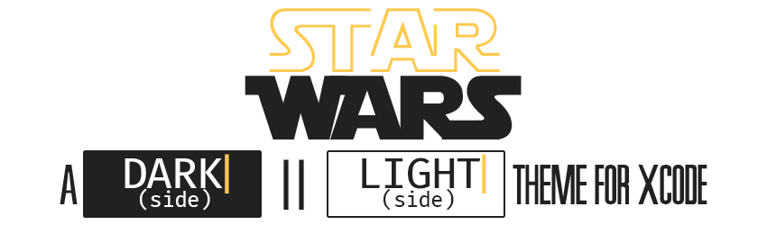
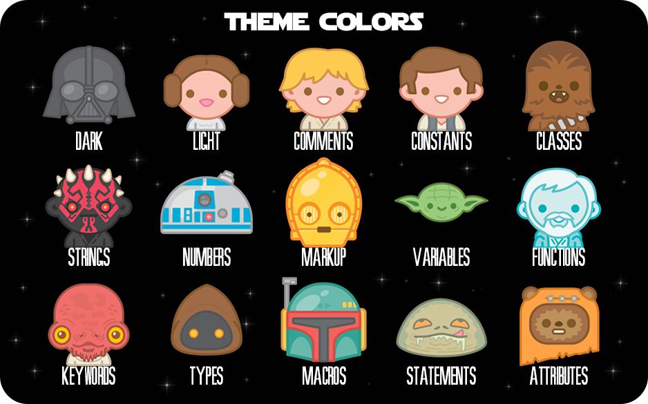
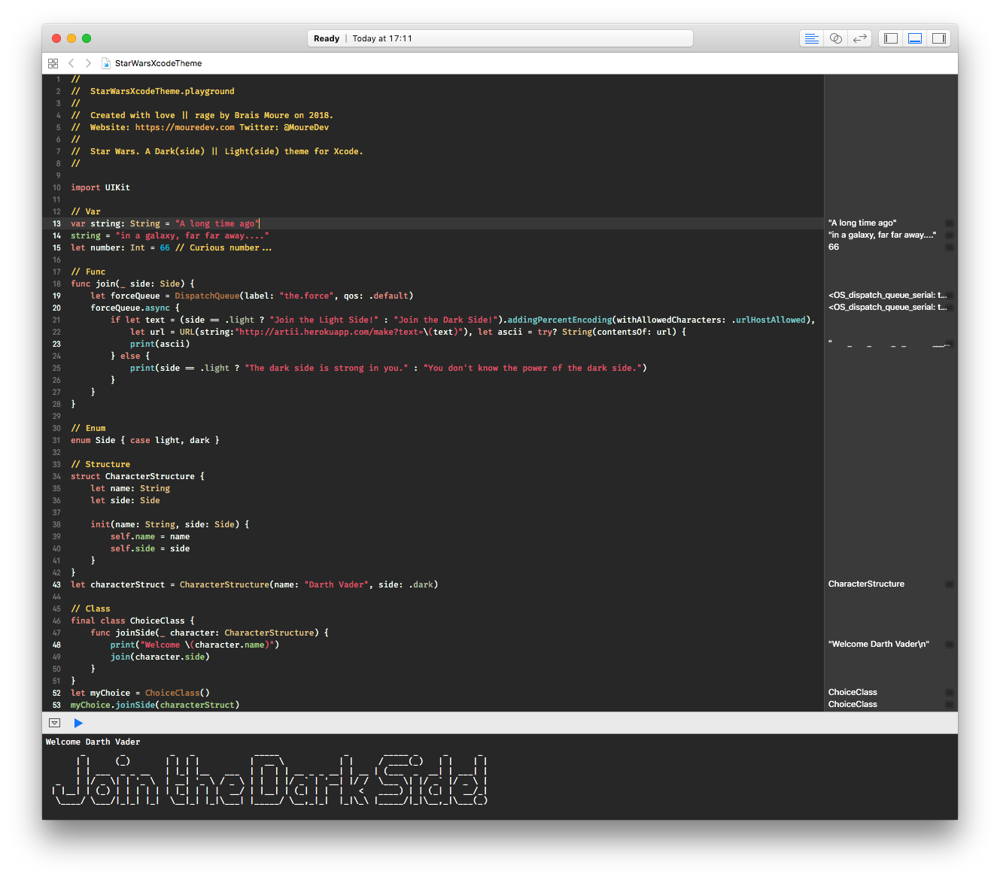
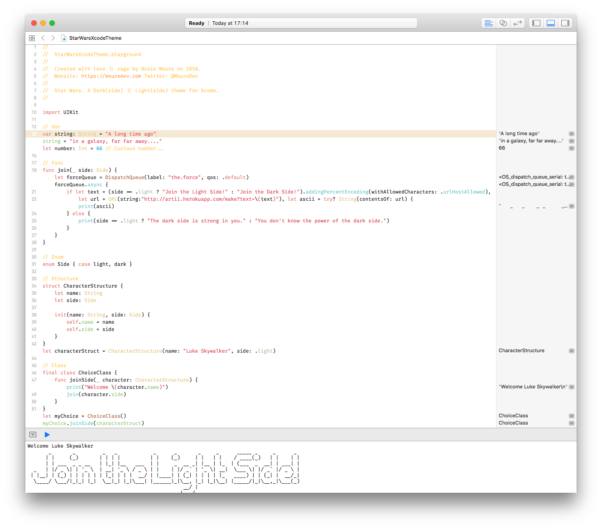

# Star Wars: A Dark(side) or Light(side) theme for [Xcode](https://developer.apple.com/xcode/)

## Dark(side) theme
Use `Star Wars Dark Side.xccolortheme` file.

## Light(side) theme
Use `Star Wars Light Side.xccolortheme` file.

## Requirements

* **Download** and install [Xcode](https://developer.apple.com/xcode/).
* **Download** the **AWESOME** [Fira Code: monospaced font with programming ligatures](https://github.com/tonsky/FiraCode) and install `Fira Code Retina` font.

## Installation

### Using Git

> 1. **Clone** the repo:
`$ git clone https://github.com/mouredev/StarWarsXcodeTheme.git`.

> 2. **Create** the custom Xcode themes folder: `$ mkdir -p ~/Library/Developer/Xcode/UserData/FontAndColorThemes/`.

> 3. **Copy** (or move) the `*.xccolortheme` files into.

### Manually

> 1. **Download** the project [Star Wars Xcode theme master](https://github.com/mouredev/StarWarsXcodeTheme/archive/master.zip) master .zip.

> 2. **Unzip** it.

> 3. **Create** the custom Xcode themes folder: `~/Library/Developer/Xcode/UserData/FontAndColorThemes/`.

> 4. **Copy** (or move) the `*.xccolortheme` files into.

## Activation

> 1. **Open** Xcode.

> 2. **Go** to `Xcode > Preferences > Fonts & Colors`.

> 3. **Choose your side**: `Star Wars Dark Side.xccolortheme` for **Dark** side || `Star Wars Light Side.xccolortheme` for **Light** side.

> 4. **Enjoy**.

## Author

*Created with love || rage by Brais Moure.
Website: [https://mouredev.com](https://mouredev.com).
Twitter: [@MoureDev](https://twitter.com/MoureDev).*

## Credits
*Stickers taken from the official [Star Wars App](http://www.starwars.com/games-apps/star-wars-app).
Star Wars is property of The Walt Disney Company & Lucasfilm Ltd. All rights reserved.*

## License
[MIT License](https://github.com/mouredev/StarWarsXcodeTheme/blob/master/LICENSE)

